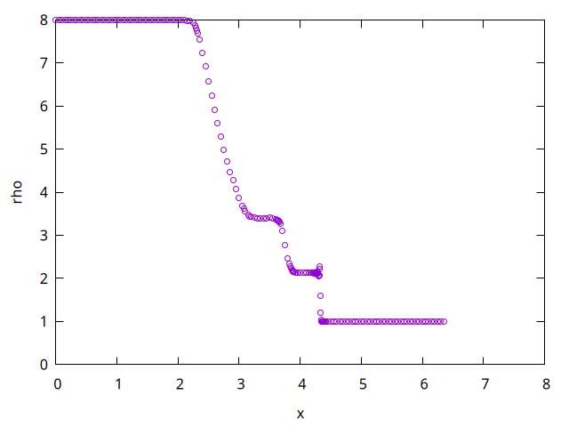
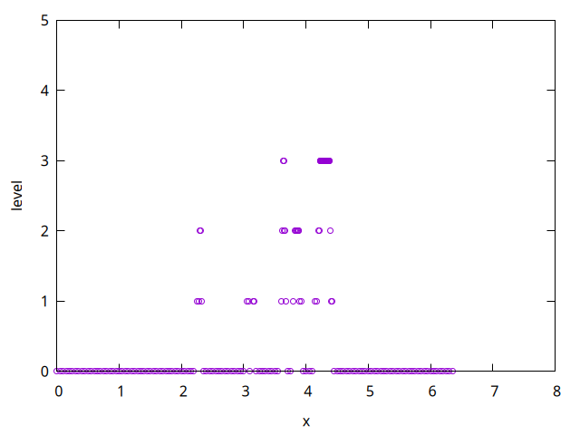

# AMR1D

# Running

```
gfortran main.f
./a.out
```
or

```
python main.py
```

# Results

See Figure 1 in [1]
<p align="center"></p>
<p align="center"></p>

# References

1. A User's Guide to AMR1D: An Instructional Adaptive Mesh Refinement
  Code for Unstructured Grids

