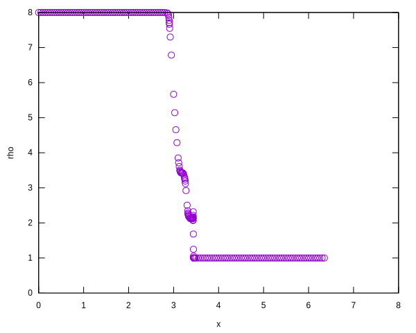

# AMR1D

# Running

```
gfortran main.f
./a.out
```

Post-processes
```
gnuplot plot0.gp
```

or

```
python main.py
```

Post-processes
```
gnuplot plot.gp
```

# Results

See Figure 1 in [1]
<p align="center"></p>
<p align="center"></p>

# References

1. A User's Guide to AMR1D: An Instructional Adaptive Mesh Refinement
  Code for Unstructured Grids

2. http://basilisk.fr/src/examples/wavelet.c